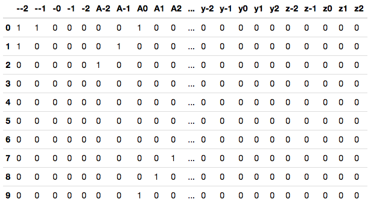
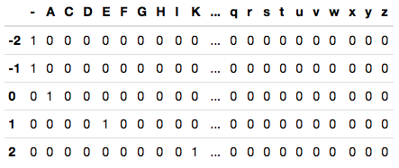
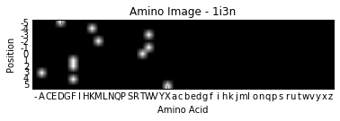

# Data Description

**dssp.data/**
* original dssp files from PDB

----------------

**raw_dssp_csv/**
* parsed dssp files, in csv format

----------------

**clean_dssp_csv/**
* pi-helix SS substitutions (HHTHH -> IIIII)
* blank SS entries replaced with 'C'
* all other blank entries replaced with '?'

----------------

**positional_dssp_csv/**
* converted proteins to have context
* filenames begin wth '(#)' for the relative spacing
* used for Probablistic Graphical Model approaches

----------------

**verbose_dssp_csv/**
* converted proteins to have context
* full feature space utilized
  * (21 amino acid symbols + 26 disulfide bridge symbols) x n positional arguments
* for use with Neural Network approaches

----------------

**tensor_dssp_npy/**
* convert proteins to context
* full feature space utlized
* feature space restructured as "amino images"
* saved as .npy files
* **NOTE**: example image below shows an individual amino image, not the full tensor

----------------

**scaled_tensor_dssp_npy/**
* Scale the tensor data by subtracting the mean of each amino image and dividing by standard deviation
* **NOTE**: example image below shows an individual amino image, not the full tensor

----------------

**Amino Image**

> 

----------------
