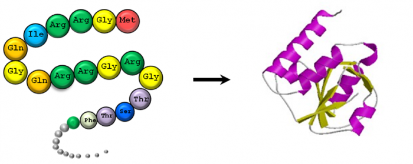

# Predicting Protein Secondary Structure
### Lucas Ramadan

This is a continuation of my previous semester's work, and the basis for my Capstone (Thesis) project at GalvanizeU

### Goal
> Given a sequence of amino acids, can we predict the structure of the protein? For each amino acid, there is a corresponding "fold-state" which we would like to infer. 

